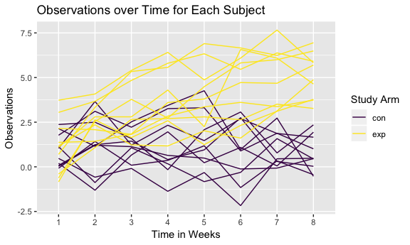
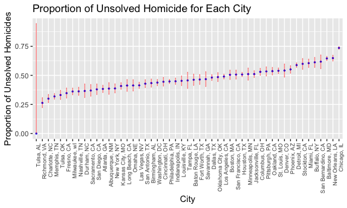

p8105\_hw5\_kb2977
================
Francois Ban
11/3/2018

Problem 1
---------

#### Part 1: Creating tidy dataframe

Below I've created a tidy dataframe containing data from all participants, including the subject ID, arm, and observations over time.

``` r
patient_data_df = 
  data_frame(patient_id = list.files(path = "./data"),
            csv_file = str_c(path = "./data/", patient_id)) %>% 
  mutate(new_var = map(csv_file, read_csv)) %>% 
  unnest() %>% 
  janitor::clean_names() %>% 
  gather(key = week, value = obs, week_1:week_8) %>% 
  separate(week, into = c("remove_1", "week"), sep = "_") %>% 
  separate(patient_id, into = c("arm", "patient_id"), sep = "_") %>%
  separate(patient_id, into = c("patient_id", "remove_2"), sep = ".c") %>% 
  mutate(patient_id = str_c(arm, patient_id, sep = "_")) %>% 
  select(-remove_1, -remove_2, -csv_file)
```

    ## Parsed with column specification:
    ## cols(
    ##   week_1 = col_double(),
    ##   week_2 = col_double(),
    ##   week_3 = col_double(),
    ##   week_4 = col_double(),
    ##   week_5 = col_double(),
    ##   week_6 = col_double(),
    ##   week_7 = col_double(),
    ##   week_8 = col_double()
    ## )
    ## Parsed with column specification:
    ## cols(
    ##   week_1 = col_double(),
    ##   week_2 = col_double(),
    ##   week_3 = col_double(),
    ##   week_4 = col_double(),
    ##   week_5 = col_double(),
    ##   week_6 = col_double(),
    ##   week_7 = col_double(),
    ##   week_8 = col_double()
    ## )
    ## Parsed with column specification:
    ## cols(
    ##   week_1 = col_double(),
    ##   week_2 = col_double(),
    ##   week_3 = col_double(),
    ##   week_4 = col_double(),
    ##   week_5 = col_double(),
    ##   week_6 = col_double(),
    ##   week_7 = col_double(),
    ##   week_8 = col_double()
    ## )
    ## Parsed with column specification:
    ## cols(
    ##   week_1 = col_double(),
    ##   week_2 = col_double(),
    ##   week_3 = col_double(),
    ##   week_4 = col_double(),
    ##   week_5 = col_double(),
    ##   week_6 = col_double(),
    ##   week_7 = col_double(),
    ##   week_8 = col_double()
    ## )
    ## Parsed with column specification:
    ## cols(
    ##   week_1 = col_double(),
    ##   week_2 = col_double(),
    ##   week_3 = col_double(),
    ##   week_4 = col_double(),
    ##   week_5 = col_double(),
    ##   week_6 = col_double(),
    ##   week_7 = col_double(),
    ##   week_8 = col_double()
    ## )
    ## Parsed with column specification:
    ## cols(
    ##   week_1 = col_double(),
    ##   week_2 = col_double(),
    ##   week_3 = col_double(),
    ##   week_4 = col_double(),
    ##   week_5 = col_double(),
    ##   week_6 = col_double(),
    ##   week_7 = col_double(),
    ##   week_8 = col_double()
    ## )
    ## Parsed with column specification:
    ## cols(
    ##   week_1 = col_double(),
    ##   week_2 = col_double(),
    ##   week_3 = col_double(),
    ##   week_4 = col_double(),
    ##   week_5 = col_double(),
    ##   week_6 = col_double(),
    ##   week_7 = col_double(),
    ##   week_8 = col_double()
    ## )
    ## Parsed with column specification:
    ## cols(
    ##   week_1 = col_double(),
    ##   week_2 = col_double(),
    ##   week_3 = col_double(),
    ##   week_4 = col_double(),
    ##   week_5 = col_double(),
    ##   week_6 = col_double(),
    ##   week_7 = col_double(),
    ##   week_8 = col_double()
    ## )
    ## Parsed with column specification:
    ## cols(
    ##   week_1 = col_double(),
    ##   week_2 = col_double(),
    ##   week_3 = col_double(),
    ##   week_4 = col_double(),
    ##   week_5 = col_double(),
    ##   week_6 = col_double(),
    ##   week_7 = col_double(),
    ##   week_8 = col_double()
    ## )
    ## Parsed with column specification:
    ## cols(
    ##   week_1 = col_double(),
    ##   week_2 = col_double(),
    ##   week_3 = col_double(),
    ##   week_4 = col_double(),
    ##   week_5 = col_double(),
    ##   week_6 = col_double(),
    ##   week_7 = col_double(),
    ##   week_8 = col_double()
    ## )
    ## Parsed with column specification:
    ## cols(
    ##   week_1 = col_double(),
    ##   week_2 = col_double(),
    ##   week_3 = col_double(),
    ##   week_4 = col_double(),
    ##   week_5 = col_double(),
    ##   week_6 = col_double(),
    ##   week_7 = col_double(),
    ##   week_8 = col_double()
    ## )
    ## Parsed with column specification:
    ## cols(
    ##   week_1 = col_double(),
    ##   week_2 = col_double(),
    ##   week_3 = col_double(),
    ##   week_4 = col_double(),
    ##   week_5 = col_double(),
    ##   week_6 = col_double(),
    ##   week_7 = col_double(),
    ##   week_8 = col_double()
    ## )
    ## Parsed with column specification:
    ## cols(
    ##   week_1 = col_double(),
    ##   week_2 = col_double(),
    ##   week_3 = col_double(),
    ##   week_4 = col_double(),
    ##   week_5 = col_double(),
    ##   week_6 = col_double(),
    ##   week_7 = col_double(),
    ##   week_8 = col_double()
    ## )

    ## Parsed with column specification:
    ## cols(
    ##   week_1 = col_double(),
    ##   week_2 = col_double(),
    ##   week_3 = col_double(),
    ##   week_4 = col_double(),
    ##   week_5 = col_double(),
    ##   week_6 = col_double(),
    ##   week_7 = col_integer(),
    ##   week_8 = col_double()
    ## )

    ## Parsed with column specification:
    ## cols(
    ##   week_1 = col_double(),
    ##   week_2 = col_double(),
    ##   week_3 = col_double(),
    ##   week_4 = col_double(),
    ##   week_5 = col_double(),
    ##   week_6 = col_double(),
    ##   week_7 = col_double(),
    ##   week_8 = col_double()
    ## )
    ## Parsed with column specification:
    ## cols(
    ##   week_1 = col_double(),
    ##   week_2 = col_double(),
    ##   week_3 = col_double(),
    ##   week_4 = col_double(),
    ##   week_5 = col_double(),
    ##   week_6 = col_double(),
    ##   week_7 = col_double(),
    ##   week_8 = col_double()
    ## )
    ## Parsed with column specification:
    ## cols(
    ##   week_1 = col_double(),
    ##   week_2 = col_double(),
    ##   week_3 = col_double(),
    ##   week_4 = col_double(),
    ##   week_5 = col_double(),
    ##   week_6 = col_double(),
    ##   week_7 = col_double(),
    ##   week_8 = col_double()
    ## )
    ## Parsed with column specification:
    ## cols(
    ##   week_1 = col_double(),
    ##   week_2 = col_double(),
    ##   week_3 = col_double(),
    ##   week_4 = col_double(),
    ##   week_5 = col_double(),
    ##   week_6 = col_double(),
    ##   week_7 = col_double(),
    ##   week_8 = col_double()
    ## )
    ## Parsed with column specification:
    ## cols(
    ##   week_1 = col_double(),
    ##   week_2 = col_double(),
    ##   week_3 = col_double(),
    ##   week_4 = col_double(),
    ##   week_5 = col_double(),
    ##   week_6 = col_double(),
    ##   week_7 = col_double(),
    ##   week_8 = col_double()
    ## )
    ## Parsed with column specification:
    ## cols(
    ##   week_1 = col_double(),
    ##   week_2 = col_double(),
    ##   week_3 = col_double(),
    ##   week_4 = col_double(),
    ##   week_5 = col_double(),
    ##   week_6 = col_double(),
    ##   week_7 = col_double(),
    ##   week_8 = col_double()
    ## )

#### Part 2: Spaghetti plot

Below is a spaghetti plot showing observations on each subject over time.

``` r
plot_1 = patient_data_df %>% 
  ggplot(aes(x = week, y = obs, group = patient_id, color = arm)) +
  geom_line() +
  labs(title = "Observations over Time for Each Subject",
       x = "Time in Weeks",
       y = "Observations") + 
  viridis::scale_color_viridis(name = "Study Arm", discrete = TRUE)
plot_1
```



Overall, the experimental study arm had greater observation values than the control arm. As time goes on, the difference between the two study arms increased. At week 1, the observations overlabed between the two study arms whereas by week 8, the observations between two arms did not overlap.

Problem 2
---------

#### Part 1: Reading in raw data and short description:

``` r
homicide_data = read_csv("https://raw.githubusercontent.com/washingtonpost/data-homicides/master/homicide-data.csv")
```

    ## Parsed with column specification:
    ## cols(
    ##   uid = col_character(),
    ##   reported_date = col_integer(),
    ##   victim_last = col_character(),
    ##   victim_first = col_character(),
    ##   victim_race = col_character(),
    ##   victim_age = col_character(),
    ##   victim_sex = col_character(),
    ##   city = col_character(),
    ##   state = col_character(),
    ##   lat = col_double(),
    ##   lon = col_double(),
    ##   disposition = col_character()
    ## )

The homicide data consists of the following variables: city, disposition, lat, lon, reported\_date, state, uid, victim\_age, victim\_first, victim\_last, victim\_race, victim\_sex. There are 52179 observations. Some variables are related to victim information and some variables are related to the location of the homicide.

#### Part 2: Creating city\_state variable

Below I've created a city\_state variable (e.g. “Baltimore, MD”) and then summarized within cities to obtain the total number of homicides and the number of unsolved homicides (those for which the disposition is “Closed without arrest” or “Open/No arrest”).

``` r
homicide_data_summarized = homicide_data %>% 
  mutate(city_state = str_c(city, state, sep = ", ")) %>% 
  group_by(city_state) %>% 
  summarize(total_homicides = n(),
         unsolved_homicides = sum(disposition == "Closed without arrest" | disposition == "Open/No arrest")) 
```

#### Part 3: Proportion of homicides unsolved for Baltimore, MD

For the city of Baltimore, MD, I used the prop.test function to estimate the proportion of homicides that are unsolved; saved the output of prop.test as an R object, apply the broom::tidy to this object and pull the estimated proportion and confidence intervals from the resulting tidy dataframe.

``` r
prop_unsolved_baltimore = 
  homicide_data_summarized %>% 
  filter(city_state == "Baltimore, MD")

balt_prop_estimates = 
  prop.test(x = prop_unsolved_baltimore$unsolved_homicides, 
            n = prop_unsolved_baltimore$total_homicides) %>% 
  broom::tidy() 

balt_prop_estimates[c(1,5,6)]
```

    ## # A tibble: 1 x 3
    ##   estimate conf.low conf.high
    ##      <dbl>    <dbl>     <dbl>
    ## 1    0.646    0.628     0.663

#### Part 4: Proportion of homicides unsolved for each city

Below I ran prop.test for each of the cities in the dataset, and extract both the proportion of unsolved homicides and the confidence interval for each.

``` r
prop_unsolved_each_city = function(each_city){

  prop_unsolved = homicide_data_summarized %>% 
    filter(city_state == each_city)

  prop_estimates = prop.test(x = prop_unsolved$unsolved_homicides, 
                            n = prop_unsolved$total_homicides) %>% 
    broom::tidy() 
  
tibble(
  estimate = prop_estimates[[1]],
  upper_CI = prop_estimates[[5]],
  lower_CI = prop_estimates[[6]]
)
}
```

``` r
each_city_nest = nest(homicide_data_summarized, total_homicides:unsolved_homicides) 

each_city_nest = 
  each_city_nest %>% 
  mutate(output = map(each_city_nest$city_state, prop_unsolved_each_city)) %>% 
  unnest()
```

    ## Warning in prop.test(x = prop_unsolved$unsolved_homicides, n =
    ## prop_unsolved$total_homicides): Chi-squared approximation may be incorrect

``` r
each_city_nest
```

    ## # A tibble: 51 x 6
    ##    city_state  total_homicides unsolved_homici… estimate upper_CI lower_CI
    ##    <chr>                 <int>            <int>    <dbl>    <dbl>    <dbl>
    ##  1 Albuquerqu…             378              146    0.386    0.337    0.438
    ##  2 Atlanta, GA             973              373    0.383    0.353    0.415
    ##  3 Baltimore,…            2827             1825    0.646    0.628    0.663
    ##  4 Baton Roug…             424              196    0.462    0.414    0.511
    ##  5 Birmingham…             800              347    0.434    0.399    0.469
    ##  6 Boston, MA              614              310    0.505    0.465    0.545
    ##  7 Buffalo, NY             521              319    0.612    0.569    0.654
    ##  8 Charlotte,…             687              206    0.300    0.266    0.336
    ##  9 Chicago, IL            5535             4073    0.736    0.724    0.747
    ## 10 Cincinnati…             694              309    0.445    0.408    0.483
    ## # ... with 41 more rows

#### Part 5: Creating a plot of estimates and CIs for each city

Below I've created a plot that shows the estimates and CIs for each city. I've organized cities according to the proportion of unsolved homicides. Tulsa, AL had the lowest proportion of unsolved homicides and Chicago, IL had the highest proportion of unsolved homicides.

``` r
plot_2 = each_city_nest %>%
  ggplot(aes(x = city_state, y = estimate)) + 
    geom_point(aes(reorder(city_state, estimate)), size = 0.5, color = "BLUE") +
    geom_errorbar(aes(ymin = lower_CI, ymax = upper_CI), 
                  color = "RED", 
                  width = 0.1, 
                  alpha = 0.5) +
    labs(title = "Proportion of Unsolved Homicide for Each City",
        x = "City",
        y = "Proportion of Unsolved Homicides") + 
    theme(axis.text.x = element_text(angle = 90, hjust = 1, size = 7))
plot_2
```


